# T-Book Web Site

<p align="center">


</p>


# Team Members

## Omar Awad.
## Aalaa Mohammed.
## Hossam Radwan.
## May Esmail.
## Ahmed Eldakhly.
            
#

# Deployment Link.
[T-Book](https://omarmohamedawad.github.io/Attack-on-Titan/index.html)

#

# Admin Pages

## Dashboard page.
The entry point of the web site to display the content of the site. 

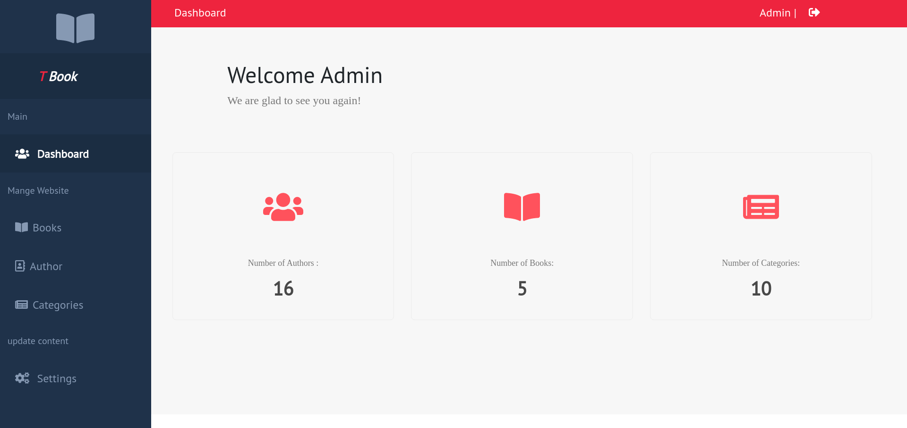

## Books table with add new book and update exist one.
The interface with the database to show, add and update books.

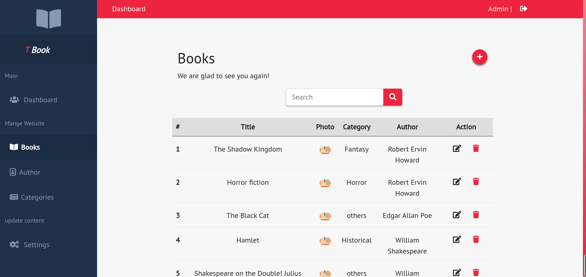
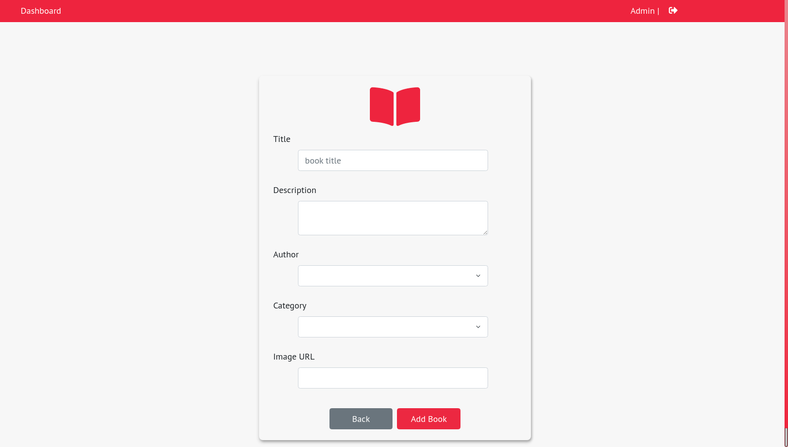
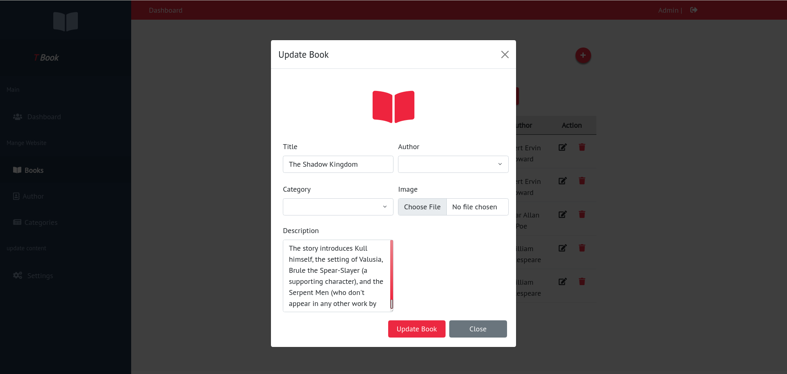

## Authors table with add new Author and update exist one.
The interface with the database to show, add and update authors.


## categories menu page with add new category and update exist one.
The interface with the database to show, add and update categorires.

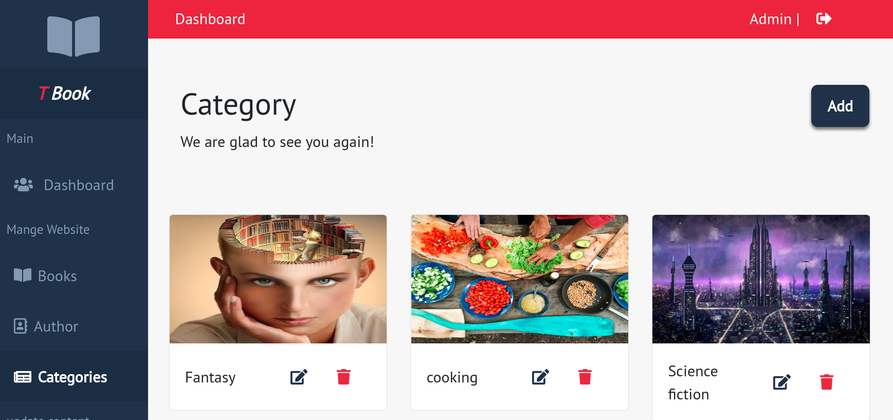
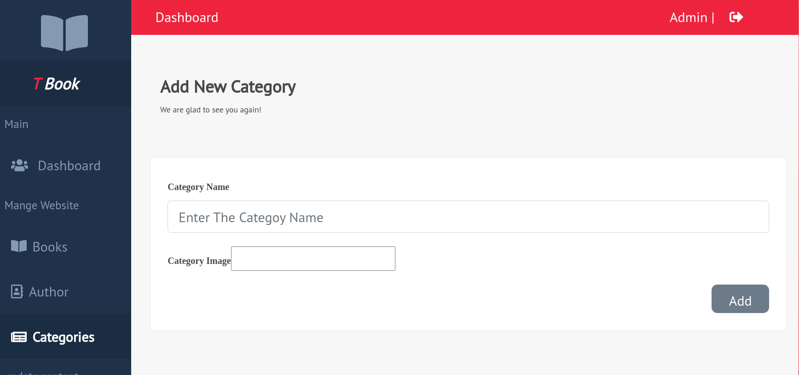

## Sittings page.
The interface with the database to insert static information about the site to display in home page and footer.

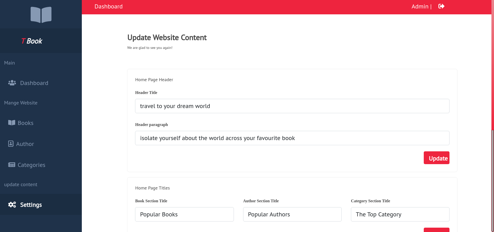

#

# User Pages

## Login & register.
The entry point for the user to see his account and add rates and reviews for any book. 
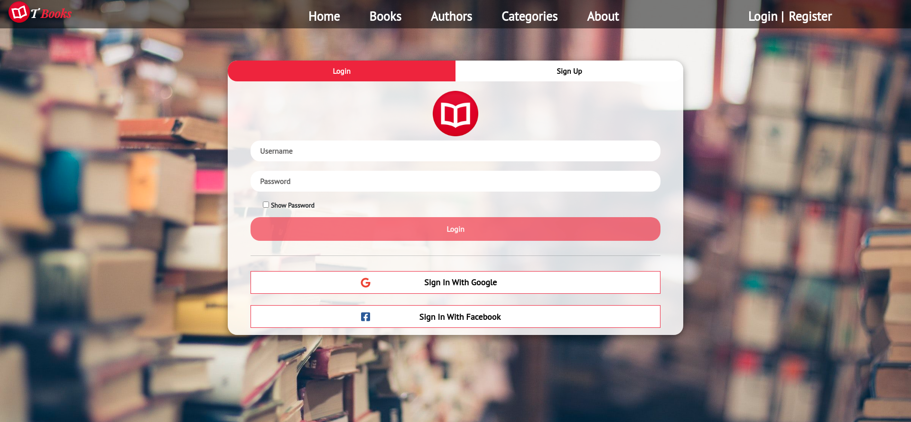
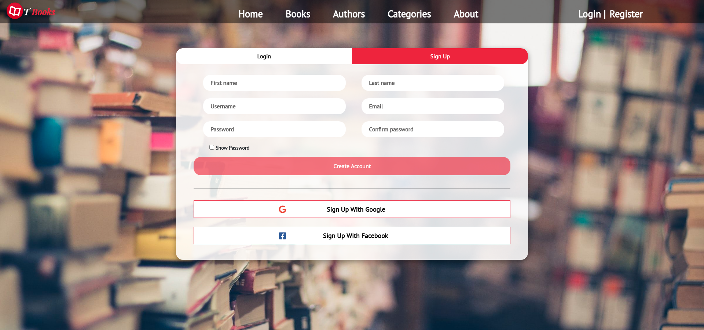


## Authors menu and Author details.
Two pages, one to show all Authors and the second one for the details for each of them with their books.

## Books menu and Book details.
Two pages, one to Two pages, one to show all Books and the second one for the details for each of them.

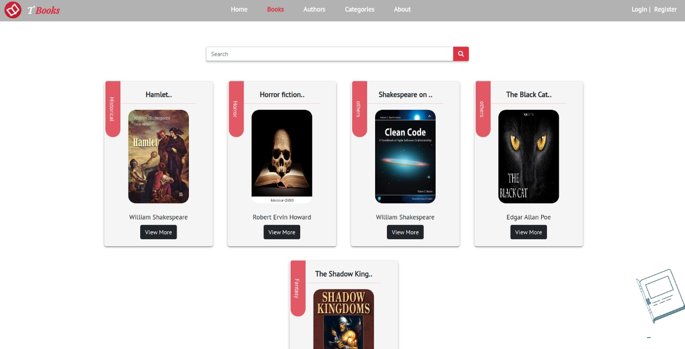


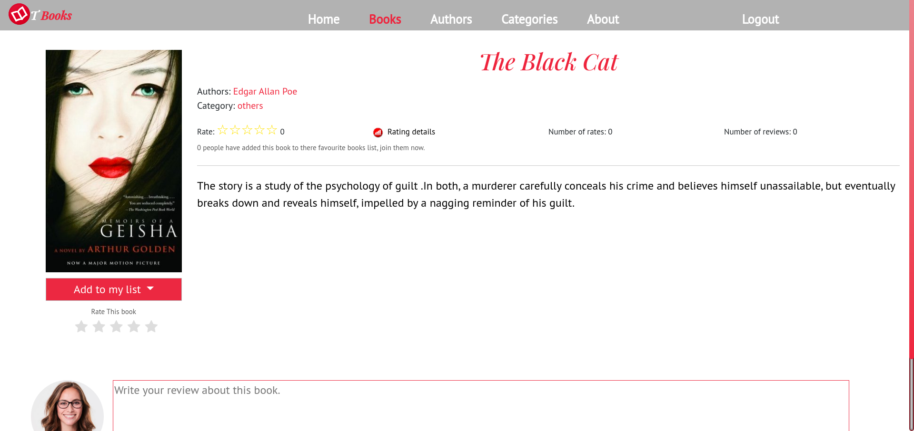

## Profile Page.
This page is available when the user login to the site to show his books (read - currently reading - want to read).

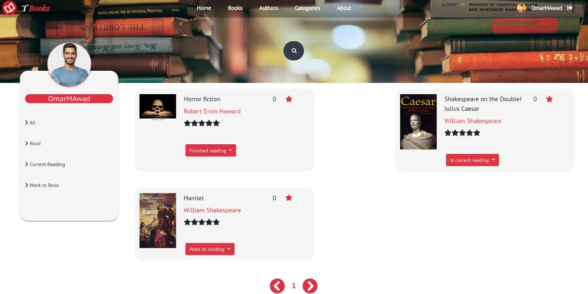

## Categories page.
Display all categories in the site with their books.

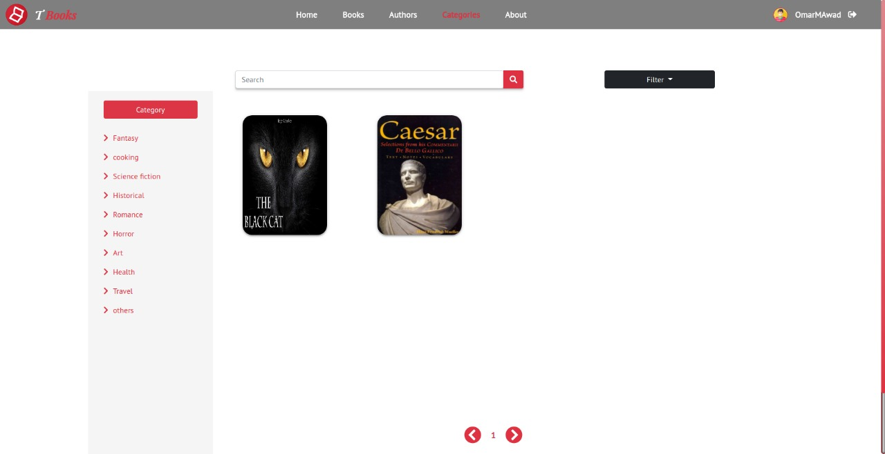

## About us page.
Contain some informations about us with our vision.


# Structure Digrams.

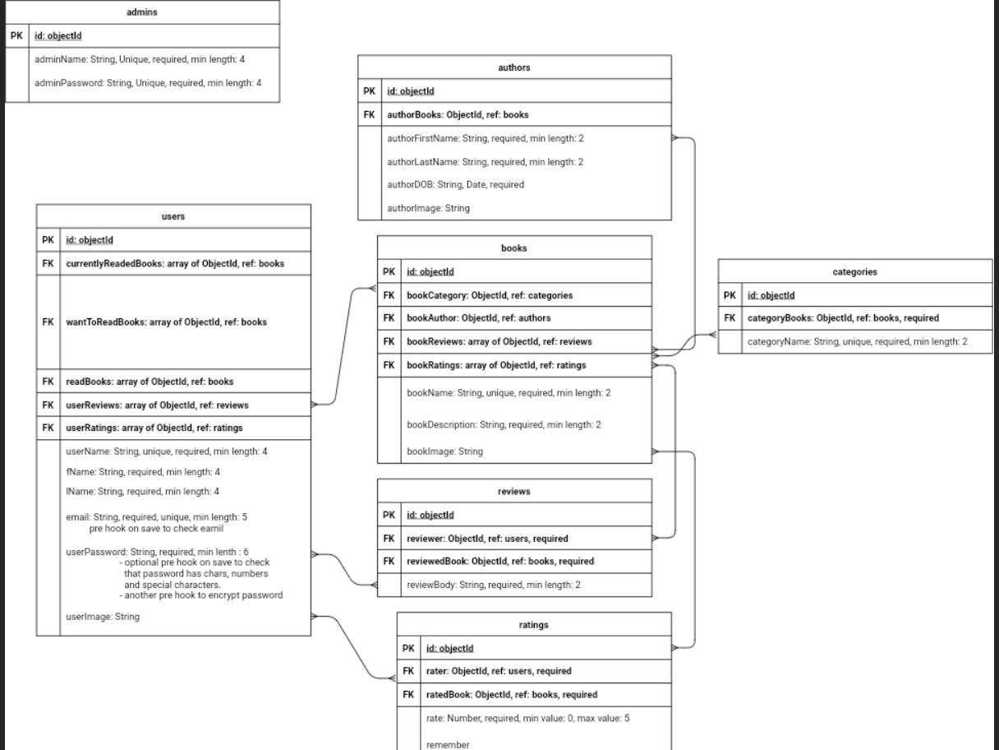

# Project files arrangement.
This project consist of:

1- backend.

    1- boot.
    2- helper.
    3- middlewares
    4- modules
        1- access
        2- admin
        3- author
        4- book
        5- category
        6- dashboard
        7- home
        8- rating
        9- review
        10- settings
        11- user
            1- controller
            2- models
            3- presenter
            4- routes

2- frontend

    1- scr
        1- app
            1- Guards
            2- pipes
            3- services
            4- modules
                1- admin-layout
                    1- admin-login
                    2- author
                    3- book
                    4- category
                    5- dashboard
                    6- route
                    7- setting
                    8- shard
                2- user-layout
                    1-about-us
                    2- access
                    3- author
                    4- book
                    5- category
                        1- service
                        2- category-books
                        3- category-header
                        4- category-sidebar
                        5- category-index
                            1- index-component.css
                            2- index-component.html
                            3- index-component.ts
                    6- home
                    7- shared
                    8- terms
                    9- user-profile
                    10- user-routings
                3- not-found
            5- app.components.css
            6- app.components.html
            7- app.components.ts
            8- app.module.ts

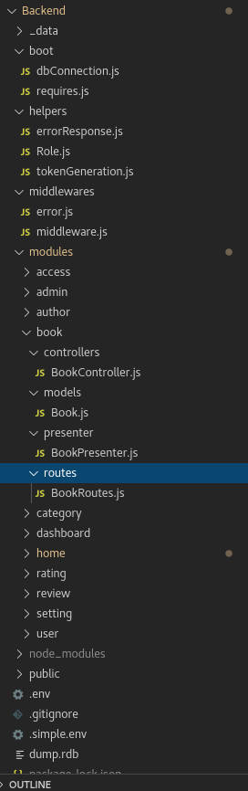
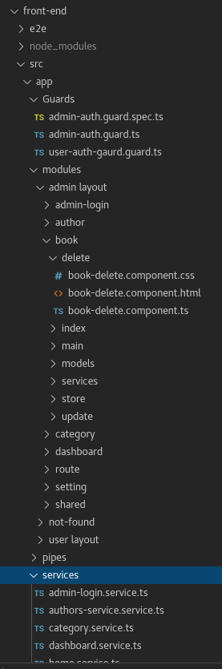


# Samples of codes.
Sample for HTML files.
```

<section class="books">
  <div class="container">
    <div class="row" *ngFor="let bookRow of books">
      <div class="col-lg-3 col-sm-6 col-8 col-xxs-9 book text-center" *ngFor="let book of bookRow">
        
      </div>
    </div>
  </div>
</section>

<section class="pagination-section">
  <div class="container">
    <div class="row">
      <div class="col-2"></div>
      <nav aria-label="Page navigation example" class="col-10">
        <ul class="pagination w-100">
          <li class="page-item"><a class="" (click)="changePagination($event, 'back')"><i class="fas fa-chevron-circle-left fa-2x"></i></a></li>
            <span *ngFor="let page of paginationPages, let i = index" >
              <li class="page-item"><a class="" *ngIf="page==currentPage; else noStar" (click)="changePagination($event, page)" style="color:  #de3242"> {{page}} </a></li>
              <ng-template #noStar>
                <li class="page-item"><a class="" (click)="changePagination($event, page)"> {{page}} </a></li>
              </ng-template>
            </span>
          <li class="page-item"><a class="" (click)="changePagination($event, 'next')"><i class="fas fa-chevron-circle-right fa-2x"></i></a></li>
        </ul>
      </nav>
    </div>
  </div>
</section>
```
Sample for CSS files.
```
.books .row {
  padding-left: 15%;
}

.books {
  margin-top: 40px;
  margin-bottom: 20px;
  height: 60%;
}

.book {
  position: relative;
}

.book:hover {
  cursor: pointer;
}

.book-image {
  width: 70%;
  height: 250px;
  border-radius: 20px;
  box-shadow: 0 3px 3px 0 rgba(0,0,0,0.2), 0 1px 7px 0 rgba(0,0,0,0.2), 0 3px 2px -2px rgba(0,0,0,0.2);
}

.book-image:hover{
  transform: scale(1.2);
  transition: all 0.3s linear;
}

.pagination-section {
  margin-top: 5%;
  justify-content: right;
}

@media only screen and (max-width: 700px) {
  .books .row {
    padding-left: 20%;
  }
}

```
Sample for TypeScript files.
```
import { Component, OnInit, Input, EventEmitter } from '@angular/core';
import Swal from 'sweetalert2';
import { CategoryService } from '../service/category.service'

@Component({
  selector: 'app-user-category-books',
  templateUrl: './user-category-books.component.html',
  styleUrls: ['./user-category-books.component.css']
})
export class UserCategoryBooksComponent implements OnInit {

  subscriber:any;
  currentPage:number = 1;
  currentCategory:string = "";

  maxPages:number = 1;
  row1:string[] = []
  row2:string[] = []
  books:string[][] = [ this.row1 , this.row2 ];
  paginationPages:number[] = [4,5,6];

  constructor(private categoryService: CategoryService) { }

  getDefaultCategory(category:string){
    this.currentCategory = category;
    this.getPage(this.currentCategory , this.currentPage);
  }
  selectCategory(name:string){
    this.currentCategory = name;
    this.currentPage = 1;
    this.getPage(this.currentCategory , this.currentPage);
  }

  searchBook(book:string){
    this.currentPage = 1;
    this.getPage(this.currentCategory , this.currentPage , book);
  }

  ngOnInit(): void {
  }

``` 

#
